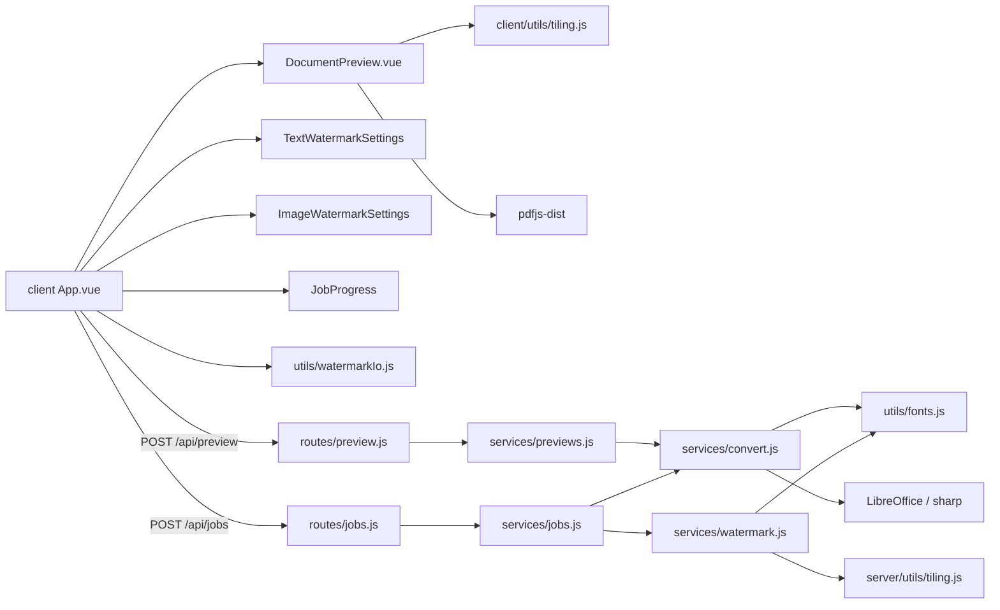

# PDF Compiler — module graph

Оновлено: 2026-08-04

## Overview

## Watermark settings

| Field | Text | Image |
|-------|------|-------|
| multiline | textarea (`\n`) | — |
| align | left / center / right / justify | — |
| placements | `portrait` + `landscape` slots (transform, spacing, fontSize) | same (no fontSize) |
| spacingX / spacingY | may be negative (overlap); step clamped ≥ 1 | same |
| save/load | JSON via `watermarkIo.js` (image → base64) | same |

Page `/Rotate` is handled via CTM in `server/utils/pageCoords.js` (`withVisualCoords`) so draws use visual coords; tiling keeps edge-overlapping copies (rotated AABB).
UI: «Позиція WM» = Авто / Книжкова / Альбомна.

## Tiling patterns

| pattern   | spacing                         | layout        |
|-----------|---------------------------------|---------------|
| single    | —                               | one copy      |
| tile      | dense (~1.1× AABB) + spacingX/Y | regular       |
| grid      | sparse (~2.05× AABB) + spacing  | regular       |
| diagonal  | medium + brick offset + spacing | odd rows +½x  |

Overflow: tiles that **intersect** the page are kept; page/stage clips them.
PDF tiling: positive row index decreases `y` (visual down, matches CSS).

## Styles

- Tokens: `client/src/styles/variables.scss`
- All UI styles: `client/src/styles/main.scss` (imported from `main.js`)
- Vue SFCs have no `<style>` blocks

- Text/md/json: `resolveDocumentFont` → DejaVu Sans (Cyrillic-safe); requires `@pdf-lib/fontkit`
- xls/xlsx/ods: LibreOffice `calc_pdf_Export` + `SinglePageSheets=true`
- Watermark StandardFonts + Cyrillic → auto-fallback to DejaVu Sans
- Fonts: `server/src/utils/fonts.js` registers fontkit per PDFDocument
- Upload names: `utils/filenames.js` decodes multer Latin-1→UTF-8 (Cyrillic in ZIP)
- Client preview cache: `client/src/utils/previewCache.js` (bytes kept after server temp cleanup)
