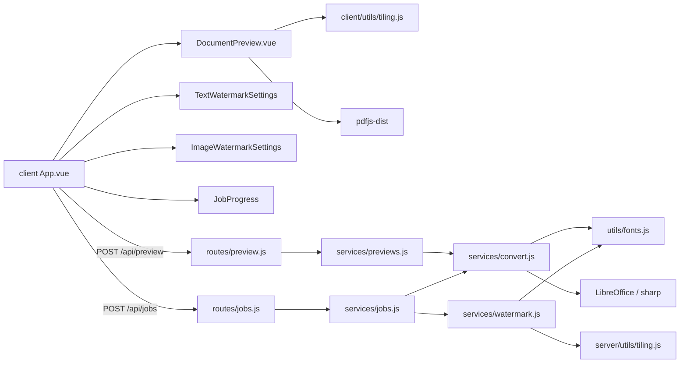

# PDF Compiler — module graph

Оновлено: 2026-08-04

## Overview

## Tiling patterns

| pattern   | spacing                         | layout        |
|-----------|---------------------------------|---------------|
| single    | —                               | one copy      |
| tile      | dense (~1.1× AABB)              | regular       |
| grid      | sparse (~2.05× AABB)            | regular       |
| diagonal  | medium + brick offset           | odd rows +½x  |

Overflow: tiles that **intersect** the page are kept; page/stage clips them.

## Styles

- Tokens: `client/src/styles/variables.scss`
- All UI styles: `client/src/styles/main.scss` (imported from `main.js`)
- Vue SFCs have no `<style>` blocks

- Text/md/json: `resolveDocumentFont` → DejaVu Sans (Cyrillic-safe); requires `@pdf-lib/fontkit`
- xls/xlsx/ods: LibreOffice `calc_pdf_Export` + `SinglePageSheets=true`
- Watermark StandardFonts + Cyrillic → auto-fallback to DejaVu Sans
- Fonts: `server/src/utils/fonts.js` registers fontkit per PDFDocument
- Upload names: `utils/filenames.js` decodes multer Latin-1→UTF-8 (Cyrillic in ZIP)
- Client preview cache: `client/src/utils/previewCache.js` (bytes kept after server temp cleanup)
