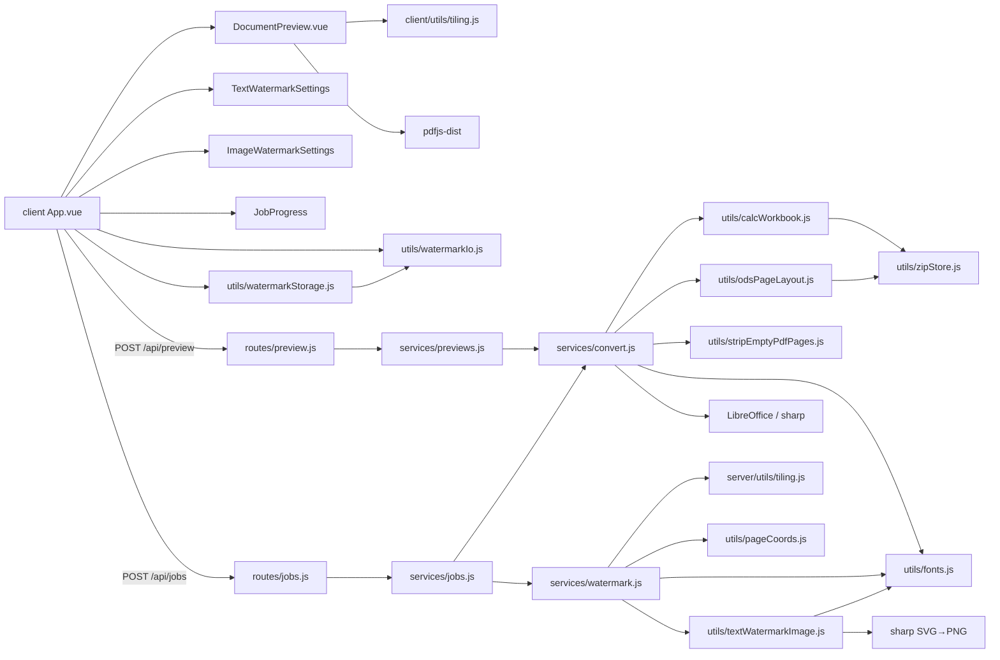

# PDF Compiler — module graph

Оновлено: 2026-08-05

## Overview

## Watermark settings

| Field | Text | Image |
|-------|------|-------|
| shared | `enabled`, `value`, `asGraphic` | `enabled` (+ image file) |
| per ori | `portrait` / `landscape`: font, B/I/U, color, opacity, align, pattern, fontSize, spacing, transform | same slots: opacity, grayscale, pattern, spacing, transform |
| multiline | textarea (`\n`) shared | — |
| save/load | header icon buttons → JSON via `watermarkIo.js` | same |

Legacy flat fields (`pattern`, `opacity`, …) migrate into both orientation slots on load.

Page `/Rotate` is handled via CTM in `server/utils/pageCoords.js` (`withVisualCoords`) so draws use visual coords; tiling keeps edge-overlapping copies (rotated AABB).
`visualBoxToDraw` compensates pdf-lib’s bottom-left rotation so it matches CSS center rotation (preview ≈ export).
Preview: CSS `rotate` on the whole `.wm` box (border + handles); Shift+drag snaps to 15°. Side panels have synced «Обертання (°)».
Preview metrics: canvas `measureText` + Unicode→DejaVu CSS; stage uses 1 PDF pt = displayScale CSS px (no 96/72); image natural aspect.
xlsx preprocess: trim to union(Print_Area, used range) (ignore XFD junk; cell trim must not treat `/>` as body open). Calc export: xlsx→ODS → patch `scale-to-X=1` landscape A4 → PDF (no SinglePageSheets). Vertical pagination via LO; strip empty pages.
Client preview: cache PDF **before** status=`ready`; replace file object; `:key` remounts DocumentPreview when ready.
All preview stages use A4 (portrait/landscape from page orientation); content fills the A4 frame. Opposite ori button disabled when a real page is shown.
Spacing sliders −500…500; number input may exceed. Last settings (+ image) persist in `localStorage` (`pdf-compiler:watermark-settings`); JSON import overwrites storage.
File thumbs: `title` tip on hover when `previewStatus === 'error'` (shows `previewError`).
UI: «Орієнтація» = Авто / Книжкова / Альбомна; save/load icons in header top-right.
Header hub nav (`client/src/utils/appNav.js`): PDF Compiler is pinned first; remaining items stay Links → Chats → Stats.

## Tiling patterns

| pattern   | spacing                         | layout        |
|-----------|---------------------------------|---------------|
| single    | —                               | one copy      |
| tile      | dense (~1.1× AABB) + spacingX/Y | regular       |
| grid      | sparse (~2.05× AABB) + spacing  | regular       |
| diagonal  | medium + brick offset + spacing | odd rows +½x  |

Overflow: tiles that **intersect** the page are kept; page/stage clips them.
PDF tiling: positive row index decreases `y` (visual down, matches CSS).

## Styles

- Tokens: `client/src/styles/variables.scss`
- All UI styles: `client/src/styles/main.scss` (imported from `main.js`)
- Vue SFCs have no `<style>` blocks
- Favicon / PWA icons: `client/public/` (+ links in `client/index.html`, paths relative to Vite `base`)
- Preview fonts: `DejaVuSans*.ttf` in `client/src/assets/fonts` via `dejavu-fonts.scss` (Cyrillic metrics ≈ server)

## Convert / fonts

- Text/md/json: `resolveDocumentFont` → DejaVu Sans (Cyrillic-safe); requires `@pdf-lib/fontkit`
- xlsx/xls/csv/ods: trim (xlsx) → ODS → `scale-to-X=1` landscape A4 → `calc_pdf_Export` → strip empty
- Convert → CalcPrep → OdsPatch → StripEmpty
- xls/ods/csv: LibreOffice `calc_pdf_Export` (no OOXML trim)
- Watermark StandardFonts + Cyrillic → auto-fallback to DejaVu Sans
- Text `asGraphic`: `textWatermarkImage.renderTextWatermarkPng` (SVG + TTF via `resolveWatermarkFontFile`) → embed PNG
- Fonts: `server/src/utils/fonts.js` registers fontkit per PDFDocument
- Upload names: `utils/filenames.js` decodes multer Latin-1→UTF-8 (Cyrillic in ZIP)
- Client preview cache: `client/src/utils/previewCache.js` (bytes kept after server temp cleanup)
